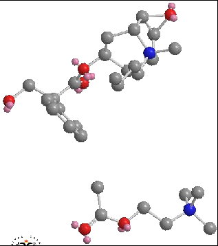
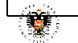
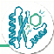

---
tags:
  - concepto
  - bioinformática
  - IA
  - CADD
---

# Diseño Racional y CADD

El Diseño Asistido por Ordenador (CADD) ha pasado de ser una promesa tecnológica a ser la base innegociable de la industria biomolecular pesada. La Inteligencia Artificial, AlphaFold y el modelado 3D han transformado la escala del desarrollo.

## Diseño Directo vs. Indirecto
Dependiendo de qué información topológica dispongamos, abordamos el fármaco desde uno u otro prisma de ingeniería in-silico:

### 1. Diseño Directo (Docking)
Se emplea cuando **sí conocemos** estrictamente la estructura 3D del receptor o proteína a tratar (normalmente obtenida mediante Cristalografía de Rayos X, Crio-EM o generada por redes neuronales como AlphaFold).

- Ya que conocemos la "Cerradura", ordenamos al ordenador ejecutar **Docking**: una simulación de atraque virtual donde millones de pequeñas moléculas prueban a rotar sobre el receptor, buscando generar la máxima puntuación energética calculada (Score) mediante enlaces Van der Waals, repulsiones estéricas e interacciones de puentes de hidrógeno.
- *Ejemplo Clínico*: El Oseltamivir (Tamiflu), concebido por docking tras la cristalización en laboratorio de la neuraminidasa del virus de la Gripe.

### 2. Diseño Indirecto (El Farmacóforo)
Se emplea cuando **NO conocemos** la estructura de nuestra diana, por lo que diseñar una molécula ideal es hacer trabajo "a ciegas".

- Dado que no vemos la cerradura, juntamos y evaluamos varias de las llaves (ligandos genéricos) que sí sabemos que consiguen abrir la puerta.
- Mediante CADD superponemos virtualmente todas o varias de las sustancias eficaces hasta aislar el **Farmacóforo**: el armazón o red de grupos químicos tridimensionales mínimos esenciales que tienen en común y que son responsables directos de ejercer el efecto terapéutico en la enzima / diana oculta.

## Inteligencia Artificial: Modelos Generativos y Diseño De Novo
El CADD ya no solo filtra y acopla química antigua, sino que la *Machine Learning* y los modelos generativos pueden "inventar" andamiajes moleculares completamente inéditos (*Scaffolds*) que nunca habían existido en la naturaleza, diseñados átomo a átomo in-situ para neutralizar específicamente el centro activo vacío.

!!! success "Caso de éxito: Halicina"
    El MIT descubrió la *Halicina* usando algoritmos neuronales, filtrando curas antibióticas superresistentes en cuestión de días. Un descubrimiento que habría llevado décadas.

*Aparece en: [Tema 3: Búsqueda del Prototipo](../themes/tema_3.md)*
