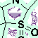

---
tags:
  - concepto
  - química
  - IUPAC
  - nomenclatura
---

# Heterociclos Libres y Condensados

## Heterociclos Simples (Libres)
Los heterociclos conforman más del 80% del vademécum estructural al sustituir carbonos alifáticos/aromáticos por un heteroátomo con pares libres para establecer puentes de hidrógeno. Tienen su propia convención para evitar formular desde cero denominando a la variante insaturada.

### Nomenclatura Hantzsch-Widman
Sistema que ensambla componentes para nombrar ciclos monoanulares (simples).

1. **Prefijo del Heteroátomo (Por Jerarquía de Prioridad)**:
    - Oxígeno → **Oxa** (Prioridad 1)
    - Azufre → **Tia** (Prioridad 2)
    - Nitrógeno → **Aza** (Prioridad 3)

    !!! tip "Elisión vocálica"
        Si interaccionan dos sufijos vocálicos, se elide la 'a' anterior; ejemplo: *oxa-* + *irano* = **Oxirano**.

2. **Raíz / Sufijo (Tamaño y Saturación)**:

    | Eslabones | Sufijo insaturado | Sufijo saturado |
    |---|---|---|
    | 3 | -ireno | -irano / -iridina |
    | 5 | -ol | -olidina |
    | 6 | -ina | -ano |
    | 7 | -epina | -epano |

## Heterociclos Condensados (Fusionados)
Sistemas con dos anillos compartiendo al menos dos eslabones carbonados "de fusión". Presentan las reglas algorítmicas de Hantzsch-Widman más complejas.

### Benzoheterociclos
Fusión `[Benceno] + [Heterociclo]`.
La cara libre se empieza a numerar siempre adyacente a la fusión, para derivar hacia el heteroátomo y darle un número mínimo. Los carbonos de fusión que pertenecen a ambos anillos llevan letras interpoladas (`4a, 7a`). **Ejemplo Clínico:** Las *Benzodiazepinas*.

### Sistemas Hetero-Heterociclos
Fusión directa entre dos heterociclos polivalentes. Requiere identificar cuál de los dos es el componente "Base" y cuál el "Anexo" para conformar la palabra (ej. *Furo[2,1-b]pirazol*).

**Jerarquía para la Elección de la Base**:

1. **Presencia de Nitrógeno**: Históricamente manda; un anillo con nitrógeno es preferido como base.
2. Tamaño de anillo: Prioridad ante el ciclo más grande.
3. El número total de heteroátomos y/o mayor diversidad de los mismos.

**Configuración del Corchete**:
Se cruzan números (del anexo) y letras de unión orientativas (del componente Base). Para nombrarlo:
`[Componente Anexo Menor - "o"] + [números del anexo, letra_b] + [Componente Base]`
*(Ejemplo: Furo[3,2-b]piridina)*.

*Aparece en: [Tema 2: Nomenclatura](../themes/tema_2.md)*
